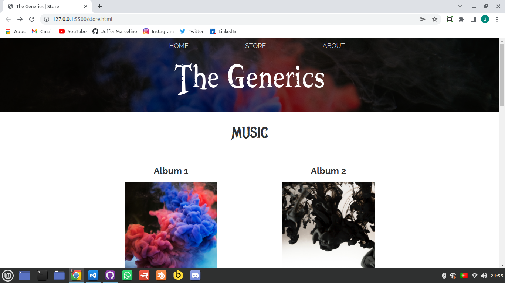
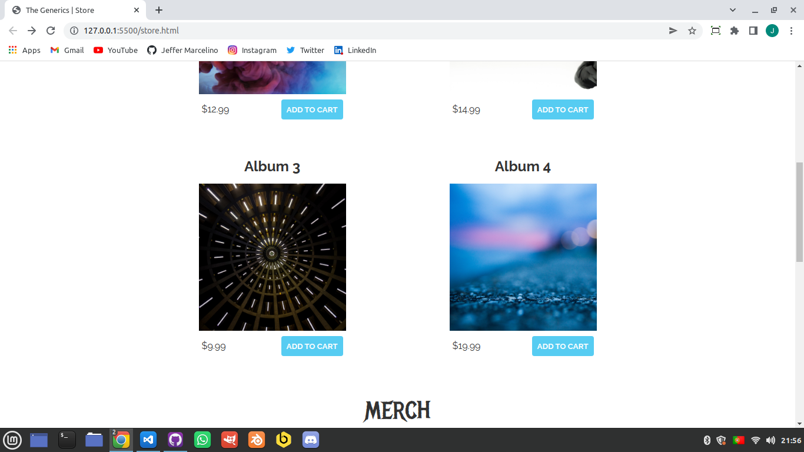
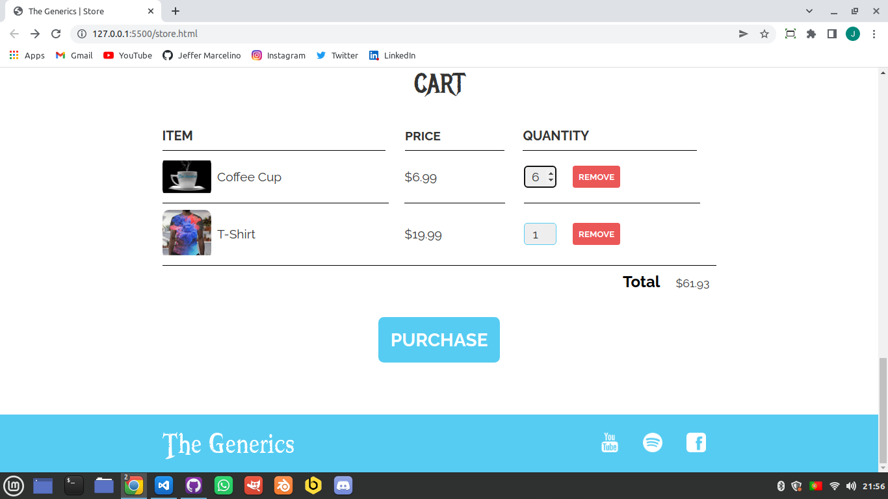

<h1>Javascript Shopping Cart</h1>

 

## Previews:

### Preview 1:

  

 

### Preview 2:

  

 

### Preview 3:

  

## 🚀 Technologies

This project was developed with the following technologies:

- HTML
- CSS
- JavaScript

## 💻 Project

Javascript shopping cart is a place to shop for rock band items. There we find the items, we can add to the cart and remove, the calculations will be calculated automatically depending on the quantity of the item and its price.

## 📝 License

This project is under the MIT license. See the file [LICENSE](./LICENSE) for more details.

---

Made by ♥ :wave: [Jeffer Marcelino!](https://github.com/JefferMarcelino/)
